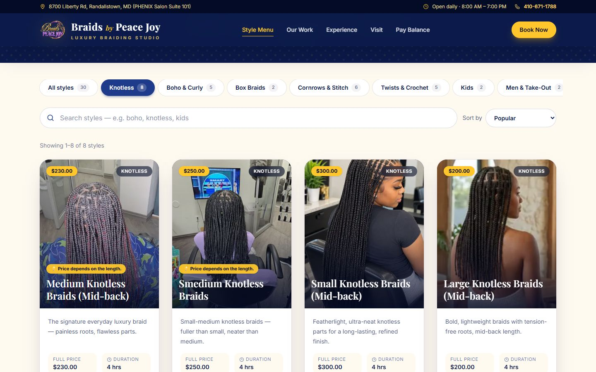
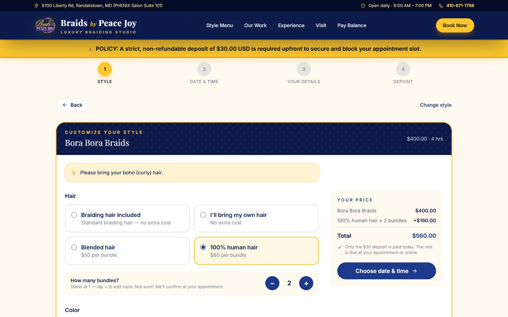
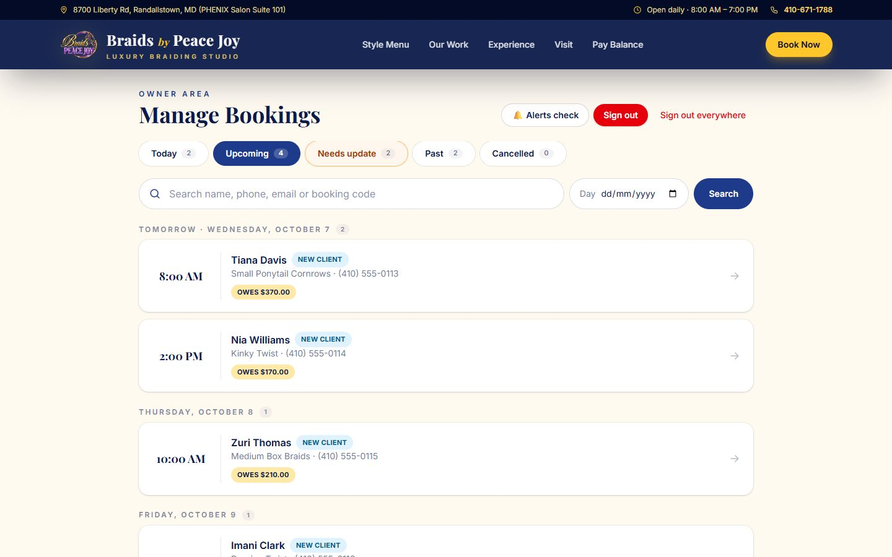
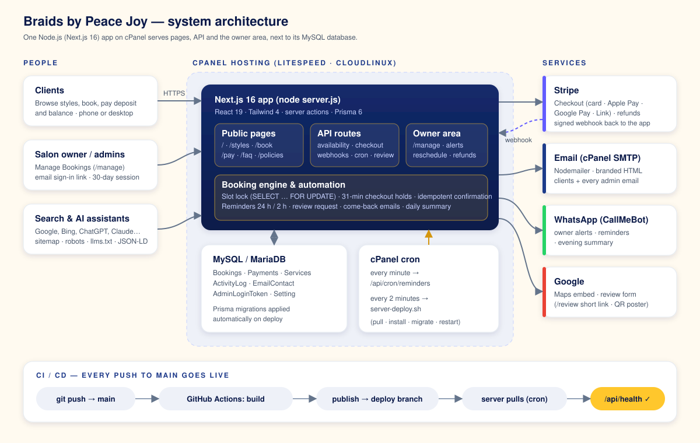
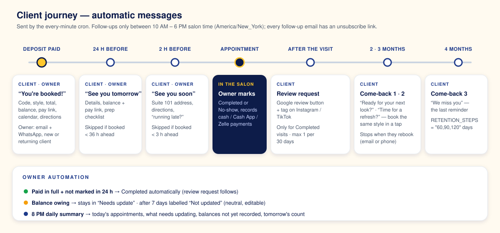

<div align="center">


# Braids by Peace Joy — Booking Platform

**Online booking, deposits, payments and client follow-up for a luxury braiding studio in Randallstown, Maryland.**

[**braidsbypeacejoy.com**](https://braidsbypeacejoy.com) · 8700 Liberty Rd, PHENIX Salon Suite 101 · 410-671-1788


</div>

---

## Contents

- [What it does](#what-it-does)
- [Screenshots](#screenshots)
- [Architecture](#architecture)
- [Booking & payment lifecycle](#booking--payment-lifecycle)
- [Notifications, reminders & follow-ups](#notifications-reminders--follow-ups)
- [Owner area — Manage Bookings](#owner-area--manage-bookings)
- [Business rules](#business-rules)
- [Tech stack & project structure](#tech-stack--project-structure)
- [Local development](#local-development)
- [Configuration](#configuration)
- [Deployment (CI/CD)](#deployment-cicd)
- [Security & privacy](#security--privacy)

---

## What it does

| For clients | For the salon owner | Runs automatically |
| --- | --- | --- |
| Browse 30 styles with real photos, prices and times | Private **Manage Bookings** area — no password, email sign-in link | **24-hour & 2-hour** appointment reminders |
| Book a slot in Maryland time (Mon–Sun, 8 AM – 7 PM) | Today / Upcoming / Needs update / Past / Cancelled | **Review request** after each completed visit |
| Customise: hair add-ons per bundle, colour mix | Record Cash App, Zelle & cash payments (client gets a receipt) | **Come-back emails** at 2, 3 and 4 months |
| Pay a **$30 deposit** (card, Apple Pay, Google Pay, Link) | Reschedule, cancel (optional refund), mark Completed / No-show | Auto-complete paid-in-full visits after 24 h |
| Pay the balance online with booking code or phone | New vs returning client badges, client history, private notes | **8 PM daily summary** to the owner |
| WhatsApp chat button, FAQ, policies | Booking alerts by **email + WhatsApp**, Alerts check page | Slot holds released, double payments refunded |

---

## Screenshots

| Style menu | Booking — customise your style |
| --- | --- |
|  |  |

| Manage Bookings (owner, demo data) | Mobile |
| --- | --- |
|  |  |

---

## Architecture



Everything runs as **one Node.js app on cPanel hosting**, next to its MySQL database — pages, API, owner area and background jobs. A cPanel cron calls `/api/cron/reminders` every minute; that single endpoint drives reminders, follow-ups, auto-complete and the daily summary.

---

## Booking & payment lifecycle

1. **Availability** — `GET /api/availability` returns every 30-minute start time from 8:00 AM, marked `available`, `booked`, `after-hours` (would finish after 7 PM) or `past`. All times are computed in **America/New_York**, whatever the server's or visitor's time zone.
2. **Deposit** — `POST /api/checkout` re-checks the slot inside a MySQL row lock (`scheduler_lock`, `SELECT … FOR UPDATE`), writes a `PENDING_DEPOSIT` hold for exactly the Stripe session's life (31 min) and creates a Checkout Session for **3000 cents**. Add-ons are re-priced on the server from the style's rules. **Two clients can never pay for the same slot.**
3. **Confirmation** — a booking becomes `DEPOSIT_PAID` only once Stripe proves payment, via the signed webhook (`checkout.session.completed`) *or* the success page's instant check. Both call the same idempotent `confirmCheckoutSession()`, so confirmation emails go out exactly once. A payment that can't be honoured (e.g. slot clash) is refunded automatically and the owner is alerted.
4. **Cancel / abandon** — pressing "back" on Stripe expires the session and frees the slot at once; abandoned sessions are released by `checkout.session.expired` or the cron sweep.
5. **Balance** — on `/pay` the client finds their booking by **booking code or phone**, and Stripe Checkout settles the rest → `FULLY_SETTLED`. Cash App / Zelle / cash payments are recorded by the owner in Manage Bookings.

---

## Notifications, reminders & follow-ups



| When | Client receives (email) | Owner receives (email + WhatsApp) |
| --- | --- | --- |
| Deposit paid | **"You're booked!"** (or "Welcome back!") — code, style, total, balance, pay link, calendar, directions, prep checklist | New booking alert — client, phone, new/returning, style, time, paid, balance, allergies |
| Balance paid / payment recorded | Receipt | Balance-paid alert |
| **24 h before** | "See you tomorrow" — details, balance + pay link, prep checklist *(skipped if booked < 36 h ahead)* | "📅 Tomorrow: client — style at time" |
| **2 h before** | "See you soon" — Suite 101, directions, "running late?" *(skipped if booked < 3 h ahead)* | "⏰ In 2 hours: …" |
| Rescheduled / cancelled by owner | New time (with calendar link) / cancellation notice | — |
| **After a completed visit** | Review request — Google review button + Instagram / TikTok *(max 1 per 30 days)* | — |
| **2, 3 and 4 months later** | Come-back emails: "Ready for your next look?", "Time for a refresh?", "We miss you" — rebook the same style in one tap | — |
| **8 PM every day** | — | Daily summary: today, what needs updating, balances not recorded, tomorrow |

**Rules that keep it respectful**

- Follow-ups are sent only **10 AM – 6 PM salon time**, and the come-back series **stops as soon as the client rebooks** — matched by **email or phone** — or unsubscribes.
- Every review / come-back email has an **unsubscribe link** (plus one-click `List-Unsubscribe` for Gmail and Apple Mail). Confirmations and reminders are always sent.
- **Unmarked appointments:** paid in full → *Completed* after 24 h; balance owing → stays in *Needs update*, then labelled *Not updated* after 7 days (no review email until the owner confirms).
- Every alert's result is recorded on the booking (`Client email ✓ · Owner email ✓ · Owner WhatsApp ✗ reason`) and visible on the **Alerts check** page.

Implementation: `src/lib/reminders.ts`, `src/lib/followups.ts`, `src/lib/summary.ts`, `src/lib/notifications.ts`, `src/lib/email-template.ts`.

---

## Owner area — Manage Bookings

`/manage` (linked as **Owner login** in the footer) is private, `noindex` and never cached.

- **Sign-in:** enter an address listed in `ADMIN_EMAIL` → one-time link (15 min, single use, rate-limited) → signed 30-day session cookie. *Sign out everywhere* revokes all devices.
- **Lists:** Today · Upcoming · Needs update · Past · Cancelled, grouped by day, with search (name, phone, email, code), a day picker and pagination.
- **Each booking:** contact buttons (call / WhatsApp / text / email), payments & balance, **record payment**, **reschedule** (only free times, client emailed, reminders re-armed), **cancel** with optional Stripe refund, Completed / No-show, private notes, paginated client history and activity log.
- **Time off:** block a whole day, several days or part of a day (or the rest of today); clients can't book it, blocked days are greyed out, and bookings already inside the time are flagged — never cancelled automatically.
- **Alerts check:** shows the email / WhatsApp / Stripe settings in use, sends test messages and lists recent delivery results.

---

## Business rules

| Rule | Value | Where |
| --- | --- | --- |
| Deposit | $30, non-refundable | `src/lib/config.ts` |
| Opening hours | Mon–Sun, 8:00 AM – 7:00 PM (style must finish by close) | `src/lib/config.ts` |
| Slot step · minimum notice · window | 30 min · 2 h · 90 days | `src/lib/config.ts` |
| Style durations | 4 h each (Extra Small Knotless 8 h) | `src/content/styles.ts` |
| Hair add-ons | Blended $50 / human $80 per bundle, client picks 1–8 · 2+ colour mix $20 | `src/lib/addons.ts` |
| Per-style hair rules | `hair: "bring"` (hair not provided) · `"none"` (no add-ons) · client notes | `src/content/styles.ts` |
| Come-back timing | `RETENTION_STEPS="60,90,120"` days | `.env` |

The style menu lives in **`src/content/styles.ts`** and is synced into the database on every deploy — edit, commit, push.

---

## Tech stack & project structure

**Next.js 16** (App Router, Turbopack, server actions) · **React 19** · **TypeScript** · **Tailwind CSS 4** · **Prisma 6** with **MySQL / MariaDB 10.6** · **Stripe Checkout** (v23) · **Nodemailer** (cPanel SMTP) · **CallMeBot** (WhatsApp) · **zod** · GitHub Actions + cPanel cron for CI/CD.

```
src/
├─ app/                    # pages, API routes, owner area
│  ├─ book/ styles/ pay/ faq/ policies/ privacy/ terms/
│  ├─ manage/              # owner area (dashboard, booking detail, alerts)
│  ├─ api/                 # availability, checkout, pay, webhooks/stripe, cron/reminders, health …
│  └─ review/ unsubscribe/ sitemap.ts robots.ts llms.txt/
├─ components/             # booking wizard, style cards, owner forms, confirm dialog
├─ content/                # styles.ts (menu) · faqs.ts
└─ lib/                    # booking engine, availability, notifications, follow-ups,
                           # reminders, summary, admin auth, secrets, SEO, time (Maryland TZ)
prisma/                    # schema.prisma · migrations/ · seed.ts (style sync)
deploy/                    # bootstrap.sh (one-time server setup) · server-deploy.sh
docs/                      # architecture diagrams · screenshots
```

---

## Local development

```bash
npm install
cp .env.example .env            # DATABASE_URL + Stripe TEST keys
npm run db:migrate:deploy       # create tables
npm run db:seed                 # sync the style menu
NOTIFY_DRY_RUN=1 npm run dev    # dry run: never sends real email / WhatsApp

# in a second terminal — forward Stripe webhooks
stripe listen --forward-to localhost:3000/api/webhooks/stripe
```

Useful scripts: `npm run typecheck` · `npm run db:migrate:new -- name` (new migration) · `npm run db:migrate:status`.

---

## Configuration

Set in the server's `.env` (see `.env.example`). Email and WhatsApp settings are read **verbatim from the file on every use** — passwords containing `$` or `#` work, and changes apply without a restart.

| Variable | Purpose |
| --- | --- |
| `NEXT_PUBLIC_SITE_URL` | Public URL (`https://braidsbypeacejoy.com`) |
| `DATABASE_URL` | MySQL connection |
| `STRIPE_SECRET_KEY` · `STRIPE_WEBHOOK_SECRET` | Payments (`sk_…` or restricted `rk_…` key) · webhook signing secret |
| `CRON_SECRET` | Protects the cron endpoint; also derives the admin session key |
| `ADMIN_EMAIL` | One or more owner emails, comma-separated — sign-in + owner alerts |
| `SMTP_HOST` · `SMTP_PORT` · `SMTP_USER` · `SMTP_PASS` · `EMAIL_FROM` | Outgoing email |
| `WHATSAPP_ALERT_NUMBER` · `CALLMEBOT_API_KEY` | Owner WhatsApp alerts |
| `WHATSAPP_CHAT_NUMBER` | "Chat with us" button |
| `GOOGLE_REVIEW_URL` | Optional override of the built-in Google review link |
| `RETENTION_STEPS` | Days for the 3 come-back emails (default `60,90,120`) |
| `GOOGLE_SITE_VERIFICATION` · `BING_SITE_VERIFICATION` | Search console verification |

---

## Deployment (CI/CD)

Every push to `main` goes live automatically:

1. **GitHub Actions** builds the app and publishes it to the `deploy` branch.
2. **The cPanel server** pulls that branch every 2 minutes — installs packages, applies **Prisma migrations**, syncs the style menu, swaps the build, restarts and purges the LiteSpeed cache.
3. **GitHub** marks the release live once `/api/health` reports the new commit.

First-time server setup is one command (`deploy/bootstrap.sh`): database, mailbox, Node.js app, `.env`, Stripe webhook and cron jobs. Full runbook: **[DEPLOYMENT.md](DEPLOYMENT.md)**.

---

## Security & privacy

- Prices are always re-computed on the server; a booking is confirmed only from Stripe's signed webhook or a verified session.
- Owner area: one-time hashed sign-in links, HMAC-signed `httpOnly` cookie, rate-limited, `noindex` + `no-store`; server actions re-check the session.
- Secrets live only in the server's `.env` (`chmod 600`), never in the repository.
- No advertising or tracking cookies; follow-up emails honour unsubscribes. See the site's [Privacy Policy](https://braidsbypeacejoy.com/privacy).
- Search-friendly: sitemap, robots, JSON-LD (local business), `llms.txt` for AI assistants, branded favicon set.

---

<div align="center">

Designed & built by **[salisu.dev](https://salisu.dev)** for Braids by Peace Joy · © 2026

</div>
